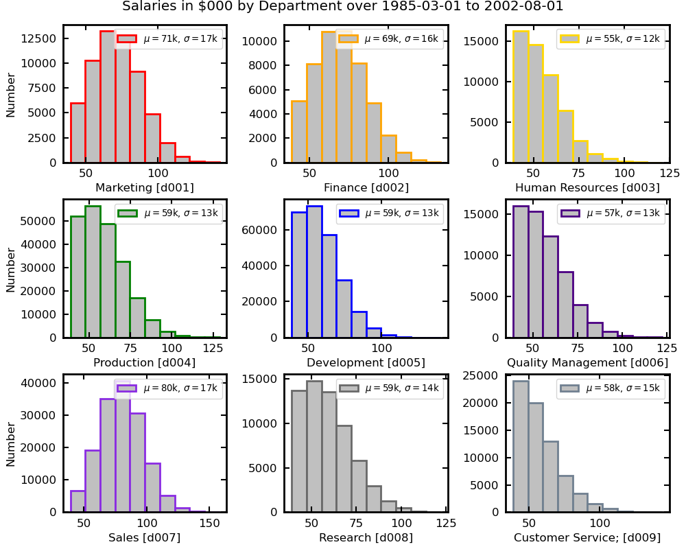

# SQL to Pandas Workbench

An interactive Streamlit workbench for learning SQL through pandas, exploring relational data, and solving real business analysis problems.

## Features

- Built-in customers, products, orders and transactions tables
- CSV/TXT/DAT/TSV upload and URL import
- SELECT, WHERE, IN and NOT IN
- GROUP BY, aggregate functions and HAVING
- INNER, LEFT, RIGHT, FULL OUTER and CROSS joins
- Same-name, different-name and multi-column join keys
- Join diagnostics for matched and unmatched rows
- ROW_NUMBER, RANK, DENSE_RANK, LAG, LEAD, cumulative sums and rolling means
- CASE WHEN
- UNION and UNION ALL
- End-to-end customer-revenue concentration analysis with notebook-style histogram and Pareto chart
- Department salary comparison using four joined employee tables
- Interactive 3 × 3 salary-distribution histograms
- Searchable SQL-to-pandas reference
- Downloadable result tables



🚀 **Run online**  https://sql-to-pandas-toolkit.streamlit.app


📓 **Run notebook:** `notebooks/SQL2pandas.ipynb

💻 **Run locally**

```bash
python3.11 -m venv .venv
source .venv/bin/activate
python -m pip install --upgrade pip
pip install -r requirements.txt
streamlit run app/sql_to_pandas_app.py
```


## Repository structure

```text
.
├── app/
│   └── sql_to_pandas_app.py
├── data/
│   ├── customers.csv
│   ├── orders.csv
│   ├── products.csv
│   └── transactions.csv
├── notebooks/
│   └── SQL2pandas.ipynb
├── src/
│   ├── datasets.py
│   ├── examples.py
│   ├── joins.py
│   ├── operations.py
│   ├── reference.py
│   ├── unions.py
│   └── windows.py
├── tests/
│   └── test_workbench.py
├── requirements.txt
├── README.md
├── LICENSE
└── .gitignore
```


## Scope

The app uses a structured query builder. It does not parse arbitrary SQL text, and it is not a substitute for validating queries against the target database engine.

